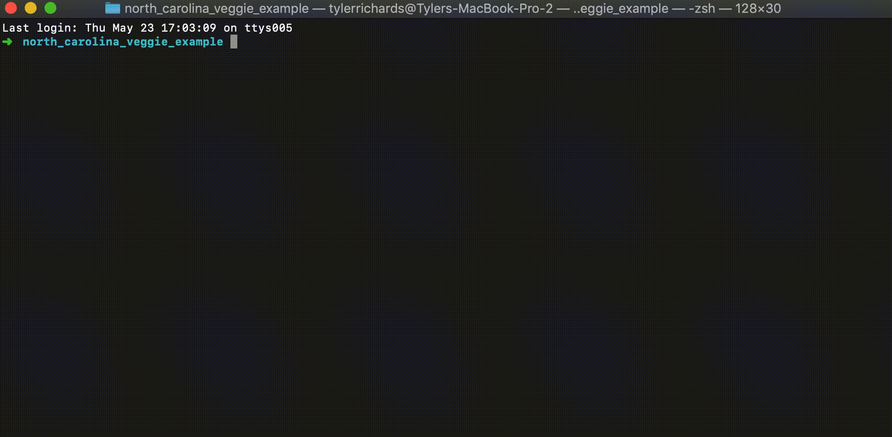

# Veggie

Veggie is a python package for reading state voter registration files.




## Using Veggie

Veggie will take your voter file and convert it into a single compressed voter file along with voter history metadata. You can use it on the command line or within Python by giving the location of the file, the state, and the date of the file snapshot. The current available states are Arizona, Colorado, Florida, Georgia, Iowa, Kansas, Michigan, Minnesota, Missouri, Nevada, New Jersey, New York, North Carolina, Ohio, Pennsylvania, and Texas.

## Examples

'''python
from veggie import convert_voter_file

nc_dataframe, metadata = convert_voter_file(state='north_carolina',
                                            local_file='nc_2018-12-22.zip',
                                            date='2018-12-22')
'''

'''bash
veg --state north_carolina --local_file nc_2018-12-22.zip --date 2018-12-22
'''

Any use of veggie will take multiple hours

## Voter History

Many states keep voter history in their voter file


## What is a Voter File?

Voter files, often referred to as voter registration lists, are files kept by state governments to determine which citizens are registered and eligible for elections. Each state keeps a voter file, has different information about each voter (sometimes keeping race, gender, email, phone number, address, and other information), charges a different amount for this public file (Ohio and North Carolina are free, while some states charge more than $10k for a file), and also keeps these files in different formats. These issues make it frustratingly difficult to get insight into how a state deals with their voters' data, and also laborious to read into analytics software like R/Python/Stata. 


## Command Line Example

## Python Example


## Veggie

Veggie will take a state voter file and return a compressed csv file with voter history at the row level

## Example Use Case: North Carolina

The North Carolina voter file is used in these examples because it is open to the public


## Installation 

$ pip install 
- download this repo
```bash
$ pip install veggie
```

## Use

## Expected File Format by State